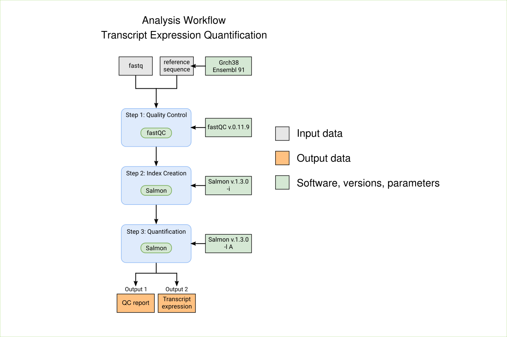

# Reproducible, scalable, and shareable analysis pipelines with bioinformatics workflow managers

Workflow managers provide an easy and intuitive way to simplify pipeline development. Here we provide basic proof-of-concept implementations for selected workflow managers. The analysis workflow is based on a small portion of an RNA-seq pipeline, using fastqc for quality controls and salmon for transcript quantification.
These implementations are designed for basic illustrations. Workflow managers provide many more powerful features than what we use here, please visit the official documentations to explore those in detail.

## The RNA-Seq workflow

The RNA-Seq analysis workflow performs quality controls with fastqc and quantifies transcripts expression using Salmon. Here we will use local installation (see documentation for [salmon](https://github.com/COMBINE-lab/salmon/) and [fastqc](http://www.bioinformatics.babraham.ac.uk/projects/fastqc/)). For the local installations you can add a symbolic link to the executables to your $PATH:

`sudo ln -s /absolute/path/salmon/bin/salmon /usr/local/bin/salmon`

`sudo ln -s /absolute/path/FastQC/fastqc /usr/local/bin/fastqc`

You can test the installation using the help function of the two tools (i.e. `salmon -h` and `fastqc -h`). 
   
## Test Data
Installing `salmon` also installs a `sample_data` directory inside the `salmon` directory.
The files `reads_1.fastq`, `reads_2.fastq` and `transcripts.fasta` are used as test data sets in these example implementations.

## Basic proof-of-concept implementations
Each workflow manager folder in this repository has a README detailing how to run the proof-of-concept pipeline:

- [Galaxy](galaxy)
- [Nextflow](nextflow)
- [Snakemake](snakemake)
- [WDL](wdl)

## Online Documentation for Workflow managers
Workflow managers have many more features which are not used in these implementations, and there are many additional workflow managers. You can read more about each workflow manager in their official documentation:

- [Galaxy](https://docs.galaxyproject.org/en/master/)
- [KNIME](https://docs.knime.com/)
- [Nextflow](https://www.nextflow.io/docs/latest/index.html)
- [Snakemake](https://snakemake.readthedocs.io/en/stable/)
- [GenPipes](https://genpipes.readthedocs.io/en/genpipes-v-3.3.0/)
- [Bpipe](http://docs.bpipe.org/)
- [Pachyderm](https://docs.pachyderm.com/latest/)
- [SciPipe](https://scipipe.org/)
- [Luigi](https://luigi.readthedocs.io/en/stable/)
- [WDL](https://openwdl.org/)
- [CWL](https://www.commonwl.org/user_guide/index.html)
- [Toil](https://toil.readthedocs.io/en/latest/)

## Contact and Contribution
Implementations were written by [Laura Wratten](https://github.com/lwratten). If you would like to add an implementation for any of these workflow managers, or if you would like to suggest changes to any of the existing implementations, please raise an issue and submit a pull request.
